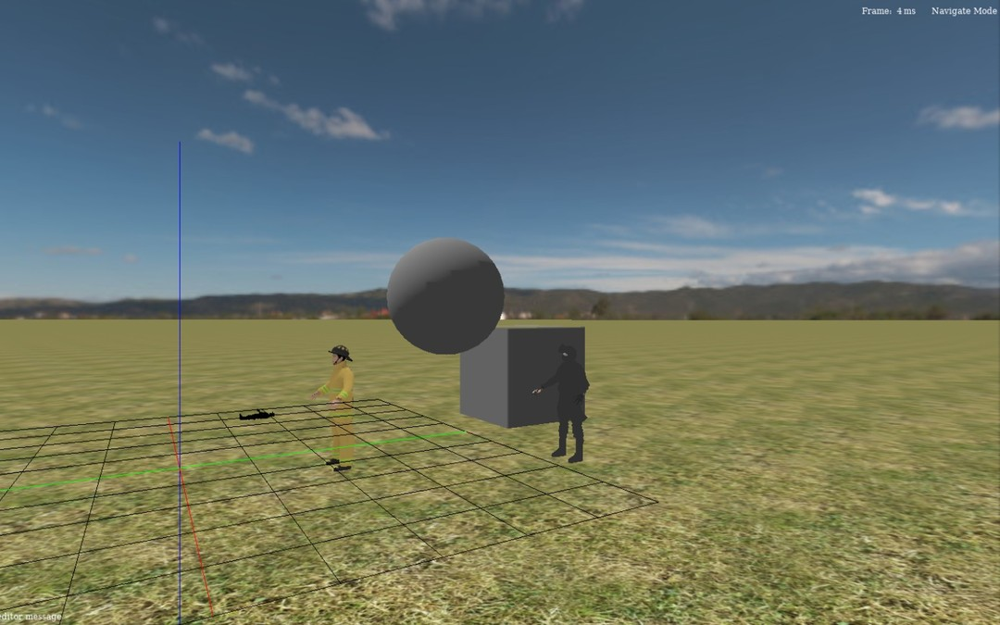

# Pavon Engine
Game Engine for GNU/Linux


Pengine builds as a static library, `lib/libpengine.a`. Games link against it and
provide their own `main()`; see `demos/chess`.

## Dependencies
- make
- gcc
- glslc
- freetype
- vulkan
- wayland, xkbcommon, EGL
- X11, OpenGL
- [cglm](https://github.com/recp/cglm) (headers only)
- [lodepng](https://github.com/lvandeve/lodepng)
- [pway](https://github.com/oscar0pavon/pway)

cglm and pway are looked for under `/usr/local`; the build adds
`-I/usr/local/include` and nothing else beyond the default paths.

## Build
```
git clone https://github.com/oscar0pavon/pengine
cd pengine
make -j8
```

This builds `lib/libpengine.a` and compiles the SPIR-V shaders in `src/shaders`.

`make install` puts the headers in `/usr/local/include/pengine` and the library in
`/usr/local/lib`. A program that installs them adds `-I/usr/local/include/pengine`
and nothing else, because the headers keep the tree they are written against.

## Run the chess demo
```
make -C demos/chess
cd demos/chess
./pchess
```
It loads its models by relative path, so run it from its own directory.

## Write a game
Fill a `PGame` with your callbacks and hand it to `pengine_run()`:

```c
#include <engine/engine.h>

void game_init(){ }
void game_update(){ }
void game_draw(){ }
void game_input(){ }

int main(){
  PGame game;
  game.init = &game_init;
  game.update = &game_update;
  game.draw = &game_draw;
  game.input = &game_input;

  pe_renderer_type = PEWMOPENGLES2;

  pengine_run(&game);
  return 0;
}
```

Compile it with the same defines and flags the engine uses — the projection
matrices depend on them — which `include.make` already carries:

```make
WORKDIR := <path to pengine>

include <path to pengine>/include.make

game: game.c
	$(CC) $(CFLAGS) $(GLOBAL_DEFINE) $(CINCLUDES) game.c \
		-L$(WORKDIR)/lib -lpengine $(LIBRARIES) -o game
```

Game objects are Elements, and an Element carries components: a
TransformComponent for its position, rotation and scale, a StaticMeshComponent
for geometry, a SkinnedMeshComponent for an animated one.
`add_element_with_model_path()` loads a glTF file into a new element.

`docs/` has more: `code.txt` on how a frame is put together, `editor_commands.txt`
and `editor_man.txt` on the editor, `android` and `compile` on the Android build.
